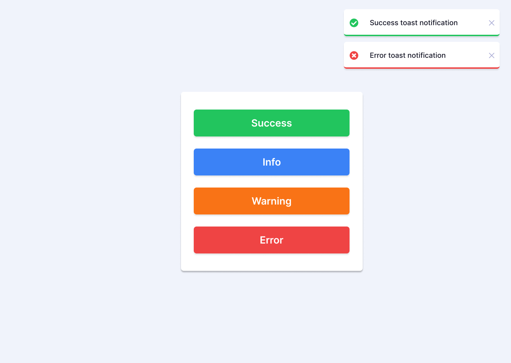

# 5-toast-notification

5th challenge

## 구현 사항

### Requirements

- [] The Toast Notification component should support displaying different types of notifications, such as success, warning, error, and information messages.
- [] The component should display notifications in the top-left corner of the page by default.
- [] Notification should automatically disappear after 4 seconds.
- [] The Toast Notification should include a dismiss button that allows the user to close the notification.
- [] The component should be able to handle multiple notifications at once and display them in a stack, with the latest notification being displayed on top.
- [] Notifications should appear and disappear smoothly, with a subtle animation.
- [] If using JavaScript frameworks or libraries like ReactJs, users should be able to show new notifications from any part of the application.
- [] Show the hover state of all the elements.
- [] The component should be responsive and display correctly on different screen sizes.
- [] Make this landing page look as close to the design as possible.

### Bonus Requirements

- [] The Toast Notification component should provide an option to customize the position of the notifications.
- [] The component should display the progress bar to display the remaining time.
- [] The auto-dismiss timer should be paused when the user hovers over the toast notification and resumes when the user moves the cursor away.

## 기술 스택

- Vanila JS

## 프로토타입

## 리뷰어 배정

<table>
<tr>
  <td>리뷰어</td>
  <td>Dotori</td>
  <td>Hemdi</td>
  <td>Oliver</td>
  <td>Rumka</td>
</tr>
<tr>
  <td>작성자</td>
  <td>Rumka</td>
  <td>Dotori</td>
  <td>Hemdi</td>
  <td>Oliver</td>
</tr>
</table>

## 참조

https://www.frontendpro.dev/frontend-coding-challenges/toast-notification-component-mHFR9GcTlWSyG8dO32Ok
